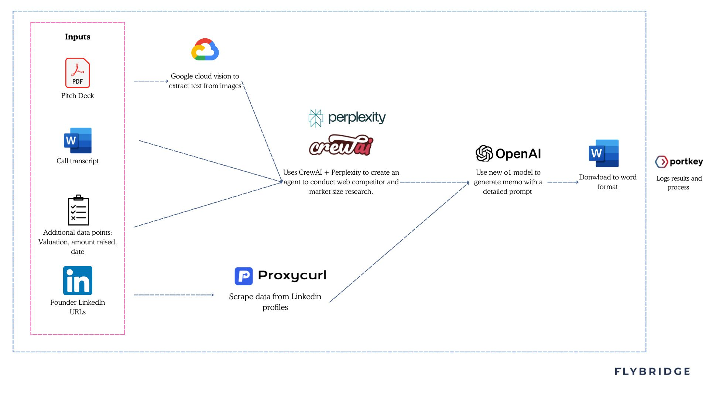

# Flybridge Investment Memorandum Generator

## Overview
The Flybridge memo generator tool is designed to quickly transform decks, business plans, and call notes into a first-draft VC investment memo. For Founders, we hope this will provide insights into how a VC firm might look at your business and streamline the process of presenting your company to investors by generating a draft memorandum based on the provided context. We recommend giving the tool as much context as possible to get the most accurate and helpful output. One of the best practices is to record your pitch and upload the transcript along with any supporting materials.

## Limitations

The memo generator provides a solid draft covering an investor’s key considerations. It does have limitations and is a first-step tool that gets you about 60% of the way to a final product, with human input still needed for nuance and judgment. In other words, use the output as a starting point, not a finished memorandum. Also, the tool may reflect biases in the input, and its reasoning is limited by the capabilities of OpenAI’s o1 model. It is meant for informational use only.


## Features

### Smart Document Processing
- Support for multiple document formats (PDF, Word, scanned documents)
- Built-in OCR capability for processing scanned materials
- Web content integration through URL processing
### Agentic research analysis
- Automated market research and competitor analysis
- Market size and growth rate calculations
### Team Analysis
- LinkedIn profile integration for founder background analysis
### Memorandum Generation
- Auto-generated comprehensive investment memorandums
### Feedback and Observability
- Integration with Portkey's feedback API for quality monitoring

# Getting Started

## Prerequisites

- Node.js (v16.x or higher)
- Python (v3.8 or higher)
- npm (Node Package Manager)
- pip (Python Package Manager)

You'll need to set up the following API keys in your environment variables:
OpenAI API Key
Portkey API Key
Perplexity AI API Key
Proxycurl API Key
Google Cloud Vision API credentials JSON file

## Installation
1. Clone the Repository
```bash
git clone https://github.com/danielp1234/memo-generator.git
cd workspace
```

2. Install Node.js Dependencies
```bash
npm install
```

3. Install Python Dependencies
```bash
pip install -r requirements.txt
```

## Set Up Environment Variables
Create a .env file in the root directory and add the following environment variables:
```env
OPENAI_API_KEY=your-openai-api-key
PERPLEXITY_API_KEY=your-perplexity-api-key
PROXYCURL_API_KEY=your-proxycurl-api-key
GOOGLE_APPLICATION_CREDENTIALS=./path-to-your-google-cloud-credentials.json
PORTKEY_API_KEY=your-portkey-api-key
PORT=3002
```

Set Up Google Cloud Vision API
- Obtain your Google Cloud Vision API credentials JSON file. Ensure you enable 
Cloud Vision API
- Place the JSON file in the root directory of the project under folder name: cloud-credentials.json


## Usage

### Production
To build and start the production server:
```bash
npm run build
npm start
```

## Project Structure
- index.js: The main Node.js server file.
- src/: Contains the React frontend code.
- components/: React components used in the frontend.
- main.py: Python script for market analysis.
- agents.py: Python script defining agents for market research.
- tasks.py: Additional Python script for tasks.
- public/: Contains static assets and the index.html file.
- .env: Environment variables configuration file.
- package.json: Node.js dependencies and scripts.
- requirements.txt: Python dependencies.

## System Diagram
- Bellow is diagram that explain the components of the application

- See example output memo [Link](https://drive.google.com/file/d/1RRfPpEildH1JYA3xVRKVKec0N0HmvZ0Q/view?usp=drive_link)


## License
Released under the MIT License. See the LICENSE file for more details.
